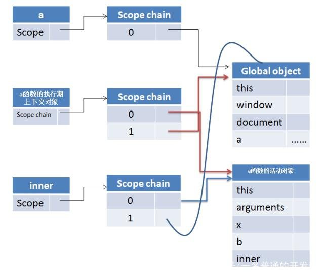
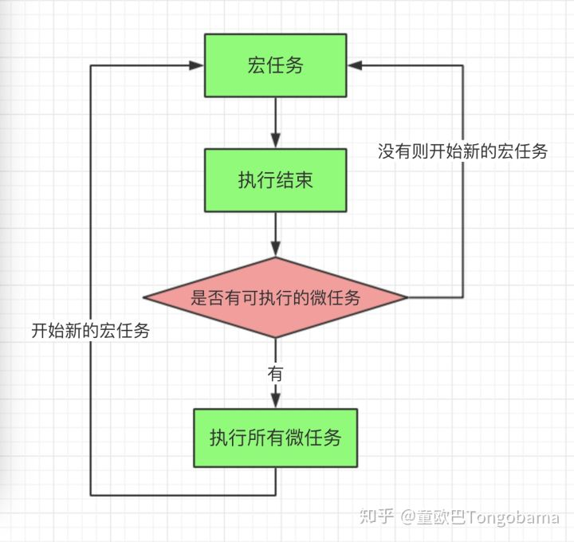

# JavaScript(ECMAscript)

<TOC />

### ES5

* `javascript`是弱类型语言。<br/>
基本数据类型 - （数字、字符串、Boolean、undefined、null）、ES6新增（symbol）。<br/>
引用数据类型 - 引用数据类型 object（对象包括【function、array】）。<br/>
原生函数 - String、Number、Boolean、Array、Object、Function、RegExp、Date、Error、Symbol

* `typeof` <br/>
typeof `null` => `object` <br/>
判断 null：`(!a && typeof a === 'object')`

* `undefined` 和 `is not defined` 是两回事，前者已声明未赋值，后者未声明。

* ECMAScript、文档对象模型（DOM）、游览器对象模型（BOM）

* 稀疏数组

* `void`

* 获取封装对象的值：`valueOf`

* `Date.now()` === `(new Date()).getTime()`

* throw new Error ('')

* 隐式强制类型转换(`valueOf()`，`toString()`) <br/>
  显式强制类转换：假值 - `undefined` `null` `false` `+0` `-0` `NaN` `''` <br/>
  `+`一元运算符能将字符串快速转换为数字，并且将日期转换为时间戳

* +、~~、!!的妙用、||、&&的使用简写、==和===的区别
  
* `[]+{} === [object Object]`  `{}+[] === 0 `
  
* 运算符优先级 `&&` > `||` > `(? : 【右关联】)` `=【右关联】` >  `,`

* `JSON.stringify()` 无法处理：`undefined`，`function`，`symbol`。该方法可以接受第二个参数JSON.stringify(a, {b,c}, num)
  
* 语句（声明语句）、表达式（赋值表达式）。表达式语句（b）

* `try…catch…finally`

* HTML元素id也会创建全局变量
  
* 变量、（变量声明、变量赋值）=> 变量的初始化

* `bind`、`call`、`apply`  
  ```
  23. 事件捕获，事件目标，事件冒泡，事件代理~事件委托（叫法不同或者说主体不同）
  24. 类，类的继承，super
  25.  原型，继承
  26.  session，cookie，sessionStorage，localStroage
  27. 红黑树算法，二叉树算法
  28. bind，call，apply
  29. 闭包，清内存，赋值为null
  31. 函数声明 、函数表达式（声明提升）
  32.  高阶函数、纯函数、函数柯里化
  33. 面向对象编程、面向函数编程
  34. set
  35.  修饰器 - 编译时执行的函数
  36.  AMD/CMD、commonjs
  37. 匿名函数
  38. 隐式换算
  39. 4种函数调用模式（this）有四种模式，函数调用，方法调用，.call() 和 .apply()。
  40. JavaScript 中的迭代器（iterators）和迭代（iterables）是什么？ 你知道什么是内置迭代器吗？
  41. JSON.parse(JSON.stringify(Obejct))的注意点
  42. 单向数据流和双向数据绑定
  43. httpXMLrequest、fetch、axios、ajax
  44. 使用单页应用将文件上传到服务器的有哪些方法(XMLHttpRequest2（streaming），fetch（non-streaming），File API)
  45. MVC、MVVM
  ```
  
### 执行上下文
[JavaScript系列之执行上下文和执行栈 - 知乎](https://zhuanlan.zhihu.com/p/68799915)

### 闭包
1. 可以访问其他函数内变量的函数，叫做闭包。或者说在一个函数内部可访问该函数内部局部变量的函数，作用就是让函数外部可以访问函数内部局部变量。
2. 闭包可以用来保存一个需要持久保存的变量，可以模拟命名空间。
3. 闭包在IE种会造成内存泄露（IE BUG）
```js
    function foo () {
        var ex = 1;
        function bar () {
            ex++
            return ex
        }
        return bar
}
var func = foo()
func()
```
[「每日一题」JS 中的闭包是什么？- 知乎](https://zhuanlan.zhihu.com/p/22486908)

### 作用域和作用域链


[js基础：作用域及作用域链](https://baijiahao.baidu.com/s?id=1627502571462484522&wfr=spider&for=pc)

### Event Loop，任务栈，宏任务，微任务（js线程）, 线程与进程




[如何解释Event Loop面试官才满意？- 知乎](https://zhuanlan.zhihu.com/p/72507900)

### 原型链


### class

class super static 继承
```jsx harmony

class myClassParents {
    parentMethods () {
        
    }
}

class myClass extends myClassParents {
    constructor () {
        super()
    }
    unstaticMethods () {
        myClass.staticMethods()
        super.parentMethods()
    }
    static staticMethods () {
        
    }
}
```

### ES6
* `let`、`const`

* 箭头函数 `() => {}`

* `class`、`class <name> extend <parent>`

* yield
```
5. 对象初始化
6. 简写方法名 const object = {functionName () {}}
7.  装饰器写法（修饰器decorator => ES6）（@connet）
8.  赋值解构
9.  rest
10. import、export
```

### Object
```
1.  Object.keys(obj)
2. Object.create()
3.  Object.assign()
4.  Object.defineProperty(obj, key, props)
```

### Array
```
1. Array.from()
2. Array.prototype.includes()
3. Array.prototype.map()
4. Array.prototype.filter()
5. Array.prototype.every()、Array.prototype.some()
6. Array.prototype.reduce()
7. Array.prototype.slice()
```

### Number
```
1. Number.prototype.toPrecision()
2. 数字的安全范围：Number.MAX_SAFE_INTEGER、Number.MIN_SAFE_INTEGER
3. Number.isInteger()
4. window.isNaN()和Number.isNaN() 在不是数字类型下返回的结果不同：isNaN(‘A') // true，Number.isNaN(‘A’) // false
```

### String
```
1. String.prototype.indexOf()
2. String.prototype.charAt()
3. String.prototype.substr()、String.prototype.substring()、String.prototype.slice()
4. String.prototype.toUpperCase()、String.prototype.toLowerCase()
5. String.prototype.trim()
```


## DOM
### DOM
```
1. nodeType(1,2,3)
2. nodeName
3.  nodeValue
4.  firstChild
5.  attributes => removeAttribute & addAttribute
6.  createDocumentFragment
7.  appendChild
```

## STYLE
### CSS
```
1. 两列自适应
2. 边距塌陷
3.  BFC
4.  伪元素，伪类
5.  css - mask镂空
6. clip-path裁剪
7. 自定义css属性
8.  :empty
9.  position: [relative, absolute, fixed, static, inherit, sticky]
10. 重绘和重排
11. CSS Flex / CSS Grid（网格）布局
```

### Less
```
1.  变量 - @
2. 混合 - <name>()
3.  函数
4.  @import
```

### Sass
```
1.  变量 - $
2. 插值 - #{}
3.  @import 和 _
4.  font的合并处理
5.  @extend
6. 占位选择器 - %
7. !optional标记
8.  @at-root
9.  @debug、@warn、@error
10. 函数 - if()
11. 指令 - @if、 @else if、@else
12. 指令 - @for $var from <start> through <end> 、@for $var from <start> to <end>
13. 指令 - @each $var in <list or map>
14. 指令 - @while
15. @mixin <name>($var1, $var2) @include @content
16.  @function
```

## Vue
### Vue
```
1. props，$emit，ref，$parent，$children
2. slot，slot-scope
3. 无渲染组件 - 组件负责行为，调用方负责表现
4. extend
5. 内置组件 component<is>
6. provide / inject - 跨组件访问
7. 为什么vue data 是一个函数
8. 指令: v-cloak v-pre v-once
9. 自定义指令 - directive（bind、inserted、update、componentUpdated、unbind）
10. v-for循环分组实现（template）
```
* [Vue服务端渲染指南](https://ssr.vuejs.org/zh/)
* [Nuxt.js](https://zh.nuxtjs.org/)

### Vue-router
```
1. scrollBehavior
```

### Vuex
```
1. state
2. action -> dispatch mutation
3. mutation -> commit（只在这里进行数据修改）
4. module
```

### TODO
* 实参 形参
* 函数
* 变量提升
* 回收机制
* VO AO
