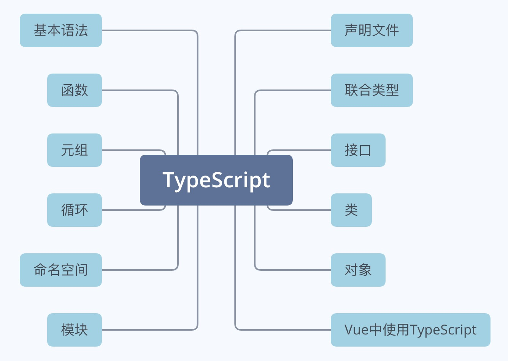

# Typescript


## 基础类型
1. `boolean`
2. `number`
3. `string`
4. `number[] || Array<number>`
5. 元祖 Tuple
6. 枚举 `enum`
7. 任意值 `any`
8. 空值 `void`
9. `null`
10. `undefined`
11. `never`

### 布尔值
```typescript
let isDone: boolean = false;
```

### 数字
```typescript
let decLiteral: number = 6;
let hexLiteral: number = 0xf00d;
let binaryLiteral: number = 0b1010;
let octalLiteral: number = 0o744;
```

### 字符串
```typescript
let name: string = 'bob';
```

### 数组
```typescript
let list: number[] = [1,2,3]
// or
let list2: Array<number> = [1,2,3]
```

### 元祖 Tuple
```typescript
let x: [string, number];
// Initialize it
x = ['hello', 10]; // OK
// Initialize it incorrectly
x = [10, 'hello']; // Error
```
当访问一个**越界**的元素，会使用联合类型替代：
```typescript
x[3] = 'world'; // OK, 字符串可以赋值给(string | number)类型
console.log(x[5].toString()); // OK, 'string' 和 'number' 都有 toString
x[6] = true; // Error, 布尔不是(string | number)类型
```

### 枚举 enum
```typescript
enum Color {Red, Green, Blue}
let c: Color = Color.Green;
```

### 任意值 any
```typescript
let notSure: any = 4;

let list: any[] = [1, true, "free"];
```

### 空值 void
```typescript
function warnUser(): void {
    alert("This is my warning message");
}

let unusable: void = undefined;
```

### null 和 undefined
```typescript
let n: null = null;
let u: undefined = undefined;
```
默认情况下（非严格模式下）null 和 undefined 是所有类型的子类型。 就是说你可以把 null 和 undefined 赋值给 number 类型的变量。

### never
never类型表示的是那些永不存在的值的类型。 例如，never类型是那些总是会抛出异常或根本就不会有返回值的函数表达式或箭头函数表达式的返回值类型； 变量也可能是never类型，当它们被永不为真的类型保护所约束时。

never类型是任何类型的子类型，也可以赋值给任何类型；然而，没有类型是never的子类型或可以赋值给never类型（除了never本身之外）。 即使any也不可以赋值给never。
```typescript
// 返回never的函数必须存在无法达到的终点
function error(message: string): never {
    throw new Error(message);
}

// 推断的返回值类型为never
function fail() {
    return error("Something failed");
}

// 返回never的函数必须存在无法达到的终点
function infiniteLoop(): never {
    while (true) {
    }
}
```

## 类型断言
***当你在 TypeScript 里使用 JSX 时，只有 `as` 语法断言是被允许的。***
```typescript
let someValue: any = "this is a string";

let strLength: number = (<string>someValue).length;
// or
let strLength: number = (someValue as string).length;
```

## 接口 interface
```typescript
interface LabelledValue {
  label: string
}

function printLabel (labelledObj: LabelledValue) {
  console.log(labelledObj.label);
}

let myObj = {size: 10, label: "Size 10 Object"};
printLabel(myObj);
```

### 可选属性
```typescript
interface SquareConfig {
    color?: string;
    width?: number
}
```

### 只读属性
```typescript
interface Point {
    readonly x: number;
    readonly y: number;
}
```
你可以通过赋值一个对象字面量来构造一个Point。 赋值后，x和y再也不能被改变了。
```typescript
let p1: Point = { x: 10, y: 20 };
p1.x = 5; // error!
```
***TypeScript 具有 `ReadonlyArray<T>` 类型，它与 `Array<T>` 相似，只是把所有可变方法去掉了。***
```typescript
let a: number[] = [1, 2, 3, 4];
let ro: ReadonlyArray<number> = a;
ro[0] = 12; // error!
ro.push(5); // error!
ro.length = 100; // error!
a = ro; // error!
```

### 函数类型
```typescript
interface SearchFunc {
    (source: string, subString: string): boolean
}

let mySearch: SearchFunc;
mySearch = function(source: string, subString: string) {
    let result = source.search(subString);
    return result > -1;
}
```


## 类
* public
* private
* protected
* readonly
* static
* abstract

```typescript
class Person {
    public name: string;              // 默认 public 公有属性
    private age: number;              // private 私有属性只能在类内部访问
    protected readonly gender:boolean // protected 保护 只有子类可以访问
                                      // readonly 只读属性 通过=或者构造函数初始化就不允许再被修改了
    constructor (name: string, age: number) {
         // 直接使用this.name 会报错 TS要求明确声明属性 声明的属性必须有初始值可以在=后面赋值，或者在构造函数中对他赋值
         this.name = name;
         this.age = age;
         this.gender = true;
    }   
    sayHi(msg: string) {
        console.log(`I am ${this.name} is age:${this.age}`);
    }
    logSay() {
        this.sayHi('你好啊');
    }
}

class Student extends Person{
    // 构造函数声明了 private 外部就不允许进行实例化类了
    private constructor(name: string, age: number){
        super(name,age);
        console.log(this.gender);
        // this.gender = false;
    }
    // 可以通过内部 new 实例返回交给外部调用
    static create(name:string,age:number){
        return new Student(name,age);
    }
}

const tom = new Person('tom',18);
console.log(tom.name);
// console.log(tom.gender);
// console.log(tom.age);

// const jake = new Student('jake',18);
const jake = Student.create('jake',18);
```

## 泛型

```typescript
function identity<T>(arg: T): T {
    return arg;
}

function crateNumberArray(len:number,value:number):number[]{
    //<number> 存放number类型的数据
    const arr = new Array<number>(len).fill(value);
    return arr;
}

const res = crateNumberArray(3,100);
//res => [100,100,100]

// 创建string类型的数据
function crateStringArray(len:number,value:string):string[]{
    //<number> 存放number类型的数据
    const arr = new Array<string>(len).fill(value);
    return arr;
}

// 通过泛型解决上述代码中的冗余部分
function createArray<T>(len:number,value:T): T[] {
    const arr = new Array<T>(len).fill(value);
    return arr;
}
```

